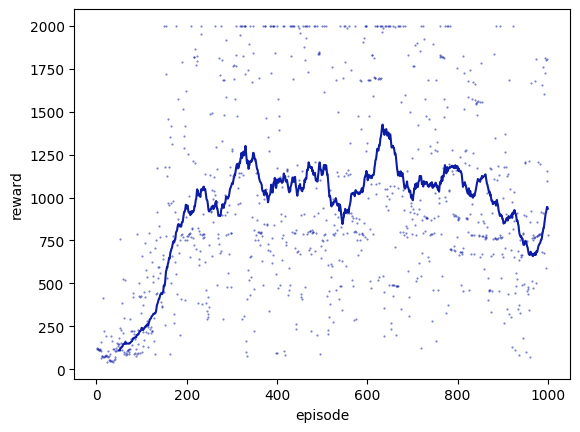
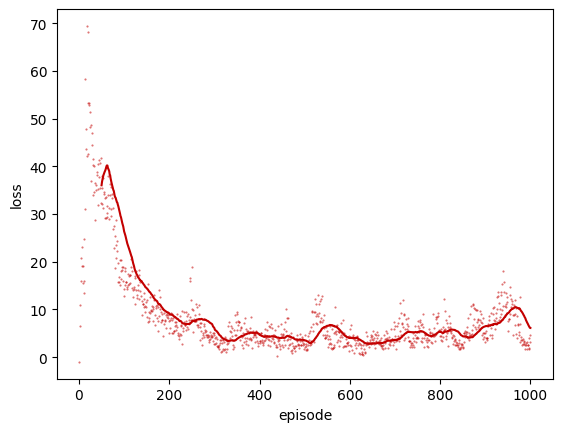

# XY Universe: a 2D particle survival environment

We provide here XY Universe: a 2D particle survival environment for Deep Reinforcement Learning agents to learn to stay alive as long as possible via avoiding collisions with "bad" particles. 
The agent and the "bad" particles are confined to a 2D box, move with fixed constant speed, and experience elastic collisions against the box walls. 
Here a Deep Q-Network agent implementation is provided for immediate usage. 
The agent reward scheme is: +1 for each time step alive, and -100 for "bad" particle collision. 
The episode termination condition is: agent collision with any "bad" particle. 
This survival environment was inspired by [Karpathy's Waterworld environment](http://cs.stanford.edu/people/karpathy/reinforcejs/waterworld.html). 

<p align="center">

</p>

Example (reward, loss) vs episode results:

<p align="center">


</p>

### Usage

```
python3 XY_universe.py
```

The output will be placed in the `output` directory, and will consist of agent models (`.h5`) and animations (`.mp4`) of the most successful episodes, as well as run logs of the entire simulation (`.csv`, `.pdf`).

### Libraries required

* tensorflow 2.0.0
* numpy, scipy, matplotlib, h5py, ffmpeg, tkinter

### Authors

Anson Wong